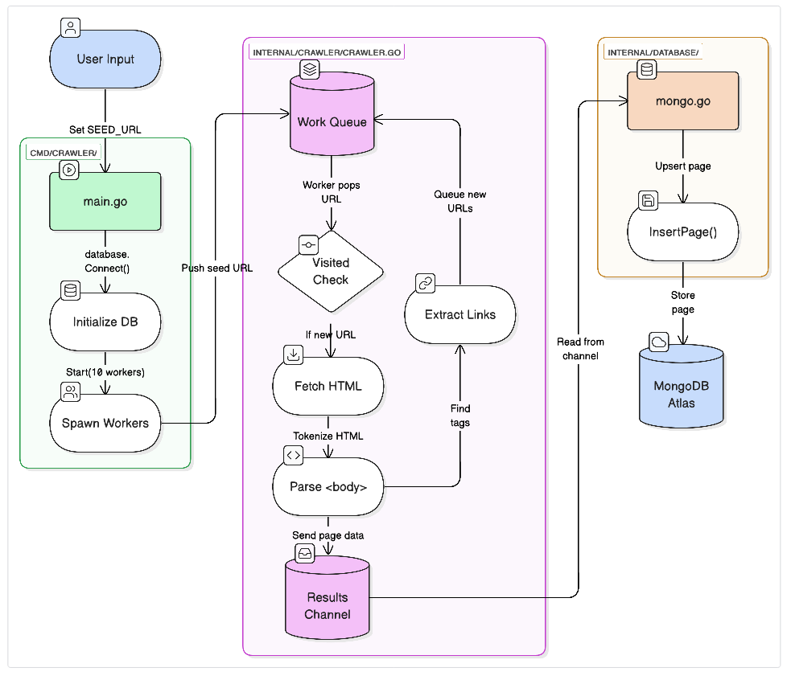
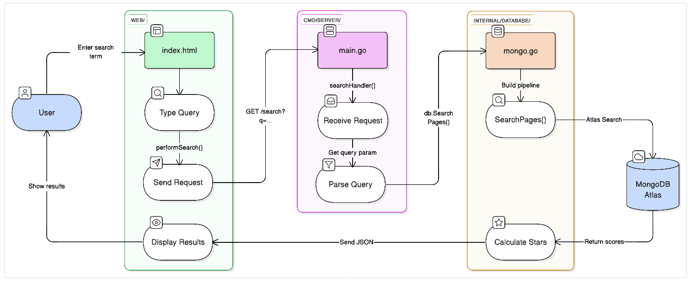
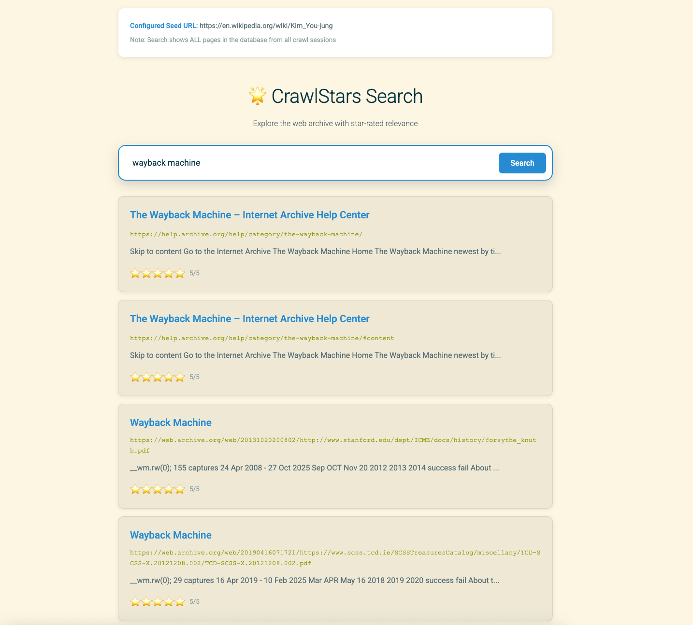

# CrawlStars DevLog

> Never have I ever... felt so passionate before about a database project.

This is an authentic and energetic devlog about why and how I built CrawlStars. 
I will justify all of my design choices by sharing my thought processes for every decision I made as I was building CrawlStars. 
I have also included the most frequently asked questions (and the questions that I asked myself!) into this devlog to answer the most common concerns about the project! 
I would appreciate any feedback you may have!

Instagram, Discord @awzheng

### Why I made CrawlStars

After playing around with Zen Browser (a popular Firefox fork) over my 1A/1B winter break I immediately realized that the URL bar autocomplete functionality was awful. 
I decided to take what I knew about SEO (from years of DECA case competitions) and attempted to build my own search engine while learning Go and MongoDB in the process. 
I've gained so much understanding and respect towards the big data and search engine industries (and would love to join them soon...)

> "Andrew! Do you play Brawl Stars?"

nah.

# Episode 1: Starting Out

## Design Choices

### Why Go over Python?

- Go is compiled. It's faster and more efficient than Python. However, the dopamine loss compared to my days of seeing my frontend update immediately when coding in Python/JS was a culture shock. lol.
- Goroutines let me spawn multiple **concurrent** workers to crawl pages at the same time. Having 10 workers makes me feel like a 10x developer while only using 10% of my CPU and several MBs of storage up in MongoDB Atlas (more on that later).
- Being statically typed means it is less prone to errors. Yes it's important since during testing, lots of websites (such as Reddit) tend to block crawlers and cause 403 errors.
- Python isn't the name of the breakout hit from CORTIS, the most notable new kpop boy band of the decade thus far.

### Why MongoDB Atlas over SQL?

The scaffolding for CrawlStars was initially built using PostgreSQL, but it was too rigid and error-prone for my purposes. 
Instead I pivoted to MongoDB Atlas, a NoSQL database. Here's why:

- JSON is flexible, and my crawler extracts data that looks like json anyway (kids these days!), thus storing it in a NoSQL database is a natural fit.
- MongoDB is optimized for high-speed ingestion which is advantageous for CrawlStars which uses 10 concurrent workers to dump data fast.
- Atlas Search is OP. A fuzzy search engine with relevance ratings that I can scale into a rating of 0-5 stars? Built into the database??? Yes please!

## Project Diagrams

These took a while on eraser.io to make but it was totally worth learning. 
Also I now have a strong preference for vertical system design diagrams! (I'm feeling existential about choosing CE over SYDE...)

### Write Path


### Read Path


> "Andrew! Why are `Work Queue` and `Results Channel` coloured purple in your Write Path diagram? Where's the node for `crawler.go`?"

Adding the node for `Work Queue` shows that we understand **concurrency** and **transient memory** (I partly learned about RAM in my ECE courses at school, but it felt more like trying to self-learn a class that I paid for).

To illustrate what I mean, imagine if the `Extract Links` step directly triggered `Fetch HTML` with no queue. 
First and foremost, this would be a massive DoS attack on the website, and would most likely result in a 403 error. 
Even if we got through and starting "eating" the website, CrawlStars would try to crawl **all the pages** from that single URL **at the same time**. 

Remember that we created many concurrent workers for a reason (default 10), and they can each find work faster than they can finish processing it. 
The queue acts as a buffer to prevent us from spawning infinite goroutines and overwhelming our RAM.

Thus, `Work Queue` and `Results Channel` are purple to represent the transient memory used by `crawler.go` (as opposed to blindly running `crawler.go` infinite times before our program gets to auto-stop at 1000).


### Project Structure

Both the read and write paths follow the same pattern: 
```
[Green] Presentation Layer
    ↓
[Purple] Business Logic Layer
    ↓
[Orange] Data Access Layer
    ↓
[Blue] Database (MongoDB Atlas)
```

And here's the project's core file structure:

```
CrawlStars/
├── cmd/
│   ├── crawler/main.go    # Crawler entry point
│   └── server/main.go     # Search API server
├── internal/
│   ├── crawler/
│   │   └── crawler.go     # Concurrent crawler logic
│   └── database/
│       └── mongo.go       # MongoDB operations and search
├── web/
│   └── index.html         # Search interface
└── go.mod
```

Here are some brief descriptions of the project structure in table format:

| Directory/File | Description | Notable Member Functions |
|----------------|-------------|-------------------------|
| **cmd/** | Main entry points for the crawler and server | - |
| `cmd/crawler/main.go` | Kicks off the crawling process with 10 workers | - |
| `cmd/server/main.go` | HTTP server that handles search requests and serves the frontend | `searchHandler()`, `infoHandler()` |
| **internal/** | Core business logic for crawling and database operations | - |
| `internal/crawler/crawler.go` | Manages concurrent workers, URL queue, and recursive crawling | `New()`, `Start()`, `worker()`, `process()` |
| `internal/database/mongo.go` | Handles MongoDB connections, page storage, and Atlas Search queries | `Connect()`, `InsertPage()`, `SearchPages()` |
| **web/** | Frontend code for the search interface | - |
| `web/index.html` | Clean search UI with star ratings and clickable results | `performSearch()`, `displayResults()` |
| **go.mod** | Lists all the Go dependencies for the project | - |
| **go.sum** | Security checksums for dependencies (auto-generated by `go mod tidy`) | - |

Okay, so now that we've established what kind of project we're making (and I'm not a complete bum), let's start building!

# Episode 2: The Write Path

Now that we've laid out the project structure, it's time to make these parts move.
I'll be breaking down the logic and decisions behind the code.
It takes a lot of love and care to ensure that your creation stays on the write path.


## internal/crawler/crawler.go

The flagship of our project, `crawler.go` manages our concurrent workers (crawlers) and our work queue (work queue).

### Crawler Struct

Here's the struct of `crawler.go`. A struct is like a blueprint for an object, and we can create multiple objects from the same struct.

```go
// Crawler is the hungry beast that eats the web.
type Crawler struct {
	db            *database.DB
	Queue         chan string
	Results       chan database.Page
	visited       sync.Map
	wg            sync.WaitGroup
	crawledCount  atomic.Int64 // Thread-safe counter for total pages crawled
	savedCount    atomic.Int64 // Thread-safe counter for successfully saved pages
	failedCount   atomic.Int64 // Thread-safe counter for failed pages
	maxCrawls     int64        // Stop after this many successful crawls
	stopRequested atomic.Bool  // Signal to stop all workers
	startTime     time.Time    // When we started crawling
}
```

A few notable features of the struct:
- visited URLs are saved to the `visited` sync.Map (bool) which ensures no duplicate URLs are crawled.
- I made several helper functions such as `isVisited()` and `markVisited()` for checking the map, and `extractTitle()` as a fallback title for URLs without `<title>` tags.
- wg is a WaitGroup (a tracker of how many workers are still running) which is used to wait for all workers to finish before the crawler can stop.

> Andrew! What's atomic.Int64?

Atomic types ensure thread safety by using atomic operations: indivisible and can't be interrupted by other threads. It uses low-level CPU instructions to update the values instantly. Seemed very appropriate for our crawler purposes!

### Constructor

Here's the constructor for `crawler.go`. 
The constructor is called to create a Crawler instance. Then, the workers are spawned in `Start()`. In simple terms:
- `New()` = build the factory
- `Start()` = spawn the minions

```go
// New constructor for a new Crawler.
func New(db *database.DB) *Crawler {
	return &Crawler{
		db:        db,
		Queue:     make(chan string, 1000),       // Buffer the queue.
		Results:   make(chan database.Page, 100), // Buffer the results.
		maxCrawls: 1000,                          // Default limit: 1000 pages
	}
}
```

I decided to set the default limit of max crawls to 1000.
Initially it was 5000, but that took several minutes per test and a lot of the pages explored a few thousand crawls in were only slight variants of other previously visited URLs.

### Start()

The `Start()` function initializes everything and gets the workers moving.

```go
func (c *Crawler) Start(seedUrl string, workers int) {
	c.startTime = time.Now()
	fmt.Println("Liftoff! Starting crawl at:", seedUrl)
	fmt.Printf("Workers: %d | Max Crawls: %d\n\n", workers, c.maxCrawls)

	// Feed the beast.
	c.Queue <- seedUrl

	// Start the Results processor (DB Inserter) in a background routine.
	var processorWg sync.WaitGroup
	processorWg.Add(1)
	go c.processResults(&processorWg)

	// Spawn the minions.
	for i := 0; i < workers; i++ {
		c.wg.Add(1)
		go c.worker(i)
	}

	// Wait for the minions to finish.
	c.wg.Wait()

	// Close result channel after workers are done
	close(c.Results)

	// Wait for processor to finish saving everything
	processorWg.Wait()

	// Show the final stats
	c.printStats()
}
```

Here's what happens step by step:

1. **Record start time**: We timestamp when crawling begins to calculate crawl speed later.
2. **Push seed URL**: SEED_URL is the first URL we crawl. It gets added to the `Queue` channel.
3. **Spawn workers**: In the for loop, we create `workers` number of goroutines (default 10), each running the `worker()` function concurrently.
4. **Background processor**: A separate goroutine (not a minion!) runs `processResults()` to save pages to the database.
5. **Wait for completion**: Once our workers finish (either by reaching 1000 or running out of URLs), `wg.Wait()` unblocks.
6. **Clean up**: Close both channels and print final statistics. At this point we're ready to run the search engine and see what we've crawled.

> "Andrew! Why do we need a separate `processResults()` goroutine? Can't workers just save to the database directly?"

This is a design pattern I learned called **producer-consumer**. 

- Picture this: if each worker saved directly to MongoDB, we'd have 10 concurrent database connections fighting for resources. 
- Instead, workers produce pages to the `Results` channel, and the consumer goroutine processes them sequentially. 
- This way, the crawling speed is seperate from the saving speed. Even if Mongo gets slow, it won't stop our workers from crawling.
- So we have a producer worker (crawler) and a consumer worker (processor).
- This makes me feel like an alpha leader and also keeps my bank account sane. 
- No need to thank me! Banks hire me pls

### worker()

There's a lot to unpack here. Brace yourself:

```go
// worker is a minion that endlessly consumes URLs.
func (c *Crawler) worker(id int) {
	defer c.wg.Done()

	for {
		// Check if we hit the limit
		if c.stopRequested.Load() {
			fmt.Printf("[Worker %d] 🛑 Stop signal received. Shutting down.\n", id)
			return
		}

		select {
		case u := <-c.Queue:
			if c.isVisited(u) {
				continue
			}
			c.markVisited(u)

			// Increment counter BEFORE processing (so we know which # this is)
			count := c.crawledCount.Add(1)

			// Check if we've hit the limit
			if count > c.maxCrawls {
				fmt.Printf("[Worker %d] 🎯 Reached max crawls (%d). Initiating shutdown.\n", id, c.maxCrawls)
				c.stopRequested.Store(true)
				return
			}

			content, title, links, err := c.process(u)
			if err != nil {
				c.failedCount.Add(1)
				fmt.Printf("Count: %d | [Worker %d] ❌ Indigestion: %s | %v\n", count, id, u, err)
				continue
			}

			// Success! Print with title
			fmt.Printf("Count: %d | [Worker %d] ✅ Eating: %s | \"%s\"\n", count, id, u, title)

			// Send to Results channel for processing
			c.Results <- database.Page{
				URL:     u,
				Title:   title,
				Content: content,
			}

			// Add new links to the menu (if we haven't hit limit yet)
			if c.stopRequested.Load() {
				return
			}

			for _, link := range links {
				if !c.isVisited(link) {
					// Non-blocking send
					select {
					case c.Queue <- link:
					default:
						// Queue full, skip it
					}
				}
			}

		case <-time.After(5 * time.Second):
			// Timeout if queue is empty
			fmt.Printf("[Worker %d] 💤 Queue empty for 5s. Quitting.\n", id)
			return
		}
	}
}
```

Our worker is a never-ending loop (empty `for` loop) that consumes URLs from the queue and processes them.
Once the URL is processed, the worker spits the extracted links from that URL back to the queue for processing and repeats the process for those links. The original (now processed) URL gets sent to the `Results` channel for database storage.

This is where the purple mini-loop **Write Path** diagram occurs. If we follow the flow of a URL through the system here's what we get:

1. **Work Queue → Visited Check**: Worker pulls URL from `Queue`, checks `isVisited()` (the diamond represents a decision point)
2. **If visited**: Skip to next URL (not pictured in the diagram for cleanliness, but it just loops back to the Work Queue)
3. **If new**: Mark as visited, then proceed to `process(url)`
4. **Fetch HTML → Parse Body → Extract Links**: All handled inside `process()` (more on this later)
5. **Extract Links → Work Queue**: Discovered links get pushed back to `Queue` (which is our main feedback loop)
6. **Parse Body → Results Channel**: Page data also goes to `Results` channel for database insertion through `mongo.go`

> "Andrew! What happens if the queue is full?"

The `select` statement with `default` is a non-blocking send, so it won't wait around for the queue to become available before moving on. 
If the queue is full (1000 URLs buffered), we skip that link instead.
Otherwise, the worker would block and wait for a slot to open, ruining our concurrency.
Thus, the main tradeoff we're making here is favouring throughput over completeness.
After all, we have 10 workers and they got work to do!
- Like some random guy in the Waterloo plaza once said: you can't change the girl, you gotta change the girl.
- don't worry that one took me a while too.

### process()

This is where we actually fetch and parse the HTML, spotted in the `worker()` as

```go
content, title, links, err := c.process(u)
```

where we process and extract the contents of the URL, essentially the "fetch and parse" part of the diagram (between `Visited Check` and `Results Channel`).
Warning: the following code is egregiously long, so prepare your scrolling fingers.
Personally I'm a middle-and-ring scroller. I feel like a rockstar when I scroll.

```go
// process fetches and parses the URL. Returns content, title, links, and error.
func (c *Crawler) process(u string) (content string, title string, links []string, err error) {
	// 1. Fetch (with manners - sites like Wikipedia hate rude bots)
	req, err := http.NewRequest("GET", u, nil)
	if err != nil {
		return "", "", nil, err
	}

	// Put on our fancy disguise. Without a User-Agent, websites think we're a spam bot.
	req.Header.Set("User-Agent", "CrawlStars/1.0 (+https://github.com/andrewzheng/CrawlStars; Educational Crawler)")

	client := &http.Client{
		Timeout: 15 * time.Second, // Don't wait forever for slow sites.
	}

	resp, err := client.Do(req)
	if err != nil {
		return "", "", nil, err
	}
	defer resp.Body.Close()

	if resp.StatusCode != http.StatusOK {
		return "", "", nil, fmt.Errorf("status code %d", resp.StatusCode)
	}

	// 2. Parse (Tokenize)
	z := html.NewTokenizer(resp.Body)
	var contentBuilder strings.Builder
	var titleText string
	inBody := false
	inTitle := false
	charCount := 0 // Count characters, not tokens (per user request)

	for {
		tt := z.Next()

		switch tt {
		case html.ErrorToken:
			if z.Err() == io.EOF {
				// Use title if found, otherwise use first 50 chars of content
				if titleText == "" {
					titleText = extractTitle(contentBuilder.String())
				}
				return contentBuilder.String(), titleText, links, nil
			}
			return "", "", nil, z.Err()

		case html.StartTagToken, html.EndTagToken:
			t := z.Token()

			// Track when we're inside <body>
			if t.Data == "body" {
				inBody = (tt == html.StartTagToken)
			}

			// Track when we're inside <title> to extract page title
			if t.Data == "title" {
				inTitle = (tt == html.StartTagToken)
			}

			// Extract links from <a> tags
			if tt == html.StartTagToken && t.Data == "a" {
				for _, a := range t.Attr {
					if a.Key == "href" {
						parsedLink, err := url.Parse(a.Val)
						if err == nil {
							base, _ := url.Parse(u)
							resolved := base.ResolveReference(parsedLink)
							if resolved.Scheme == "http" || resolved.Scheme == "https" {
								links = append(links, resolved.String())
							}
						}
					}
				}
			}

		case html.TextToken:
			text := strings.TrimSpace(z.Token().Data)
			if len(text) == 0 {
				continue
			}

			// Extract title text from <title> tag
			if inTitle && titleText == "" {
				titleText = text
			}

			// Extract body content (first 500 characters only)
			if inBody && charCount < 500 {
				// Filter out very short fragments (likely navigation/menu items)
				// Only accept text that's at least 10 characters to avoid noise
				if len(text) < 10 {
					continue
				}

				remaining := 500 - charCount
				if len(text) > remaining {
					contentBuilder.WriteString(text[:remaining])
					charCount = 500 // We're done collecting content
				} else {
					contentBuilder.WriteString(text + " ")
					charCount += len(text) + 1
				}
			}
		}
	}
}
```

Here's a quick summary.

1. **User-Agent header**: Without this, many sites block us with 403 Forbidden errors. We identify ourselves as an educational crawler because that's who we are. Educational. And hopefully an employed one at that.
2. **15-second timeout**: Prevents loitering on slow sites, I feel too slow for this life as it is, let's not make things worse.
3. **html.Tokenizer**: We use Go's HTML tokenizer to extract:
   - Page title from `<title>` tag
   - First 500 characters from `<body>` (filtering out fragments < 10 chars to avoid navigation noise)
   - All `<a>` tag links for the feedback loop

...and it can be simplified into the clean nodes `Fetch HTML → Parse <body> → Extract Links` that you see in the diagram. Impressive huh?

## cmd/crawler/main.go

cmd/crawler/main.go is the orchestrator that ties everything together.

```go
func main() {
	// Configuration (Environment Variables or Defaults)
	mongoURI := os.Getenv("MONGO_URI")
	if mongoURI == "" {
		mongoURI = "mongodb://localhost:27017"
	}

	seedURL := os.Getenv("SEED_URL")
	if seedURL == "" {
		seedURL = "https://en.wikipedia.org/wiki/Computer_science" // As requested!
	}

	workerCountStr := os.Getenv("WORKERS")
	workerCount, err := strconv.Atoi(workerCountStr)
	if err != nil || workerCount == 0 {
		workerCount = 10
	}

	log.Println("🌟 CrawlStars is initializing...")
	log.Printf("Target Database: %s", mongoURI)
	log.Printf("Seed URL: %s", seedURL)
	log.Printf("Worker Count: %d", workerCount)

	// 1. Connect to DB
	db, err := database.Connect(mongoURI)
	if err != nil {
		log.Fatalf("Failed to connect to DB: %v", err)
	}
	defer db.Disconnect()
	log.Println("✅ Database connected.")

	// 2. Initialize Crawler
	c := crawler.New(db)

	// 3. Launch!
	c.Start(seedURL, workerCount)
}
```


### Environment Configuration

The first thing you'll notice is the environment variables.
These are based on user input for mongoURI, seedURL, and workerCount.
- mongoURI: The MongoDB connection string. Defaults to "mongodb://localhost:27017" if not specified.
- seedURL: The URL to start crawling from. Defaults to "https://en.wikipedia.org/wiki/Computer_science" if not specified.
- workerCount: The number of workers to use. Defaults to 10 if not specified.

> Andrew! Why does workerCount default to 10? Wouldn't it be faster to use more workers?

Nope, and believe me, I tried. This is because concurrent programming has diminishing returns, and at some point, the overhead of managing more workers outweighs the benefits of parallelism.
For example, when I ran it with 100 workers, it was actually slower than 10 workers.
The queue wouldn't fill up fast enough to require more than 10+ workers anyway, so a lot of the workers were idling and taking up precious system resources.
It's kind of like working in a group project with too many group members. It's less efficient per person overall.
10 workers proved to be the sweet spot for CrawlStars.

### The Launch Sequence

After the env variables, we connect to the database and initialize the crawler. 
As long as there's no error, it'll launch successfully and print a success message to the terminal.
Then, a crawler is structured and launched.
Remember, a "crawler" is a "worker pool" (which spawns multiple worker goroutines) that's structured to crawl a website.
Finally, we call `Start(seedURL, workerCount)` on the crawler, which launches the worker pool and begins the crawl!

## internal/database/mongo.go

This is our final stop in the write path before our pages ascend to the MongoDB Atlas heavens! For the write path, there are 2 main functions: `Connect()` and `InsertPage()`. Let's first look at the `Page` struct which is used to represent a webpage in our database.

```go
// Page holds the data for a crawled webpage.
type Page struct {
	URL     string  `bson:"url"`
	Title   string  `bson:"title"`
	Content string  `bson:"content"`
	Score   float64 `bson:"score,omitempty"` // MongoDB's search score (for internal use)
}
```

As you can see, it's a simple struct with 4 fields: `URL`, `Title`, `Content`, and `Score`. The `Score` field is used for MongoDB's search score (for internal use).

### Connect(): Knocking on Mongo's Door

`Connect()` is the first function in the write path. It takes a `mongoURI` as input and returns a `DB` struct and an error if something went wrong. (Yes, another cool thing about Golang that I didn't know before is having multiple return variable types for methods!)

```go
// Connect connects to the database. Don't forget to unplug it later!
func Connect(uri string) (*DB, error) {
	ctx, cancel := context.WithTimeout(context.Background(), 60*time.Second)
	defer cancel()

	// Show a nice loading indicator with elapsed time
	done := make(chan bool)
	go func() {
		start := time.Now()
		ticker := time.NewTicker(500 * time.Millisecond)
		defer ticker.Stop()

		fmt.Print("⏳ Connecting to database")
		for {
			select {
			case <-done:
				fmt.Print("\r\033[K") // Clear the line
				return
			case <-ticker.C:
				elapsed := time.Since(start).Seconds()
				// \r returns to start of line, \033[K clears to end of line
				fmt.Printf("\r⏳ Connecting to database... (%0.1fs elapsed)", elapsed)
			}
		}
	}()

	// Knock knock. Who's there? Mongo.
	client, err := mongo.Connect(ctx, options.Client().ApplyURI(uri))
	if err != nil {
		close(done)
		time.Sleep(50 * time.Millisecond) // Let the goroutine clean up
		return nil, fmt.Errorf("failed to knock on Mongo's door: %w", err)
	}

	// Ping it just to be sure it's awake.
	if err := client.Ping(ctx, nil); err != nil {
		close(done)
		time.Sleep(50 * time.Millisecond)
		return nil, fmt.Errorf("mongo is sleeping (ping failed): %w\n💡 Tip: Make sure MONGO_URI is set to your Atlas connection string!", err)
	}

	// Stop the loading indicator
	close(done)
	time.Sleep(50 * time.Millisecond) // Let the goroutine clean up

	// We're in! Prepare the collection.
	coll := client.Database("crawlstars").Collection("webpages")

	// Ensure the URL is unique. duplicated content is so last season.
	_, _ = coll.Indexes().CreateOne(ctx, mongo.IndexModel{
		Keys:    bson.D{{Key: "url", Value: 1}},
		Options: options.Index().SetUnique(true),
	})

	return &DB{client: client, coll: coll}, nil
}

// Disconnect says goodbye to the database.
func (db *DB) Disconnect() error {
	return db.client.Disconnect(context.Background())
}
```

Look at the loading indicator goroutine.
It's a sneaky producer-consumer pattern!
The main goroutine is connecting to the database while this goroutine is printing a loading indicator to the terminal.
Communication is key in all healthy relationships!

> Andrew! What does the underscore `_` mean?

The underscore `_` also known as the blank identifier is a throwaway variable in Go that we don't use. 
It's a convention in Go to indicate that we don't care about the value returned by a function. 
In this case, we don't care about the result of `coll.Indexes().CreateOne()`, so we use the blank identifier to indicate that we don't care about it.
Here, we're discarding the `mongo.UpdateResult` which contains metadata like how many documents were modified. 
Since we only care if it succeeded (via the error), we can just ignore this result.

As you can see, lots of the code was written for user-friendliness and printing status messages to the terminal. 
Disconnect is also important to disconnect from the database, clean up resources, and save my bank account.

We also use a MongoDB index (kinda like a map) to prevent duplicate saves:

```go
// Ensure the URL is unique. duplicated content is so last season.
	_, _ = coll.Indexes().CreateOne(ctx, mongo.IndexModel{
		Keys:    bson.D{{Key: "url", Value: 1}},
		Options: options.Index().SetUnique(true),
	})
```

### InsertPage(): Safe Keeping

`InsertPage()` is the final function in the write path. It takes a `Page` struct as input and inserts it into the database. It also returns an error if something went wrong.

```go
// InsertPage tucks a webpage into the database for safe keeping.
// If it already exists, we give it a makeover (update).
func (db *DB) InsertPage(page Page) error {
	opts := options.Update().SetUpsert(true)
	filter := bson.M{"url": page.URL}
	update := bson.M{"$set": page}

	_, err := db.coll.UpdateOne(context.Background(), filter, update, opts)
	return err
}
```

> Andrew! Why are we using UpdateOne() instead of InsertOne()?

We use `UpdateOne()` with the `Upsert` option set to `true` to insert the page if it doesn't exist, or update it if it does. 
This is standard practice in MongoDB for upserting documents.
If two of our workers were to somehow process the same URL at the same time (race condition), the second one would be upserting the first entry instead of tweaking out.
Plus, we would be updating the first entry in case there's somehow an improvement in the page.

As you can see here, the blank identifier `_` is another throwaway variable that we don't use in case `InsertPage()` returns an error.

### Completing the Write Path

Now, we're experts in every aspect of the write path! 
I hope you feel as satisfied as I did when I looked back on the write path diagram and realized that I had finally completed and understood every node of it.
That's how I knew that I was on the write path.

# Episode 3: Read-y, Go!

Ok I admit this episode title is a bit of a stretch.
Cut me some slack!
"Write" and "Read" are oddly phonetically similar.
Let's forget about that and instead focus on this extremely aesthetic read path diagram!


It's about as intuitive as it gets: the user interacts with the frontend `index.html` which tells the backend `main.go` and `mongo.go` to search for a query using MongoDB Atlas' search functionality (including fuzzy matching). 
The backend then calculates the star rating based on relevance score and returns the results to the frontend which displays them to the user.
It's pretty much my best attempt at turning our crawlbot database into a fully functional and charming little search engine.
Yeah I know the algorithm needs work, but hey at least there aren't any ads or "real" singles in our area!
Just kidding, I go to Waterloo. I'm the single in the area.

## cmd/server/main.go

The search server is where users send their queries and get back results. 
Unlike the crawler which runs once and exits, this server runs continuously and waits for HTTP requests (aka the user typing in their query into our amazing search bar.)

### The Server Setup

```go
func main() {
	mongoURI := os.Getenv("MONGO_URI")
	if mongoURI == "" {
		mongoURI = "mongodb://localhost:27017"
	}

	port := os.Getenv("PORT")
	if port == "" {
		port = "8080"
	}

	// Show what we're connecting to (helpful for debugging)
	displayURI := mongoURI
	if strings.Contains(mongoURI, "@") {
		// Redact password for security
		parts := strings.Split(mongoURI, "@")
		if len(parts) == 2 {
			credPart := strings.Split(parts[0], "://")
			if len(credPart) == 2 {
				displayURI = credPart[0] + "://***@" + parts[1]
			}
		}
	}
	log.Printf("🔌 Connecting to: %s", displayURI)

	var err error
	db, err = database.Connect(mongoURI)
	if err != nil {
		log.Fatalf("🔥 Failed to connect to DB: %v", err)
	}
	defer db.Disconnect()
	log.Println("✅ Database connected. Server listening on port " + port)

	// Serve the frontend HTML
	http.HandleFunc("/", homeHandler)

	// API endpoint for search
	http.HandleFunc("/search", corsMiddleware(searchHandler))

	// API endpoint to get current configuration
	http.HandleFunc("/info", corsMiddleware(infoHandler))

	log.Printf("🌐 Open your browser to: http://localhost:%s\n", port)
	log.Fatal(http.ListenAndServe(":"+port, nil))
}
```

Aha! Finally a `main()` function! 
Was it worth the wait?
Let's walk through it from top to bottom.
- First we get the MongoDB URI and port from environment variables so that we can run it at port 8080 as a default.
- Then we let the user know that we're connecting to the database.
    - Notice the password redaction logic! In case we share screenshots or log files of the server running, we don't want to show the password.
- If we've connected successfully, we can call in our frontend HTML and set up our HTTP handlers `http.HandleFunc()` for the /search and /info endpoints.
- We can finally start the server and give the user a link straight to the server.

> Andrew! Where did HandleFunc() come from?

`http.HandleFunc()` is a Go function that registers a normal function as an http handler for a specific URL pattern.
HTTP handlers are functions that take a `http.ResponseWriter` and a `*http.Request` as parameters.
Then, the handler function can use the `http.ResponseWriter` to write a response back to the client and the `*http.Request` to access the request data.
In this case, we're using it to register the `homeHandler`, `searchHandler`, and `infoHandler` functions (that we gotta write ourselves!) for the root URL pattern "/".

> Andrew! Why do we need both the `/search` and `/info` endpoints?

Both `searchHandler()` and `infoHandler()` are HTTP handlers in the read path, but they serve different purposes.
- `searchHandler()`is for the frontend to handle the actual search queries. For example, if we type `computer science` into the search bar, it calls GET `/search?q=computer+science` and returns a JSON array of the search results.
- `infoHandler()` provides metadata about the current crawler configuration. It calls GET `/info` and returns a JSON with the seed URL and MongoDB Atlas cluster info. This information is always present in CrawlStars at the top banner.
- It's an important REST API design principle for each endpoint to have a single responsibility.
- i.e. caching: the frontend can cache `/info` for this crawler's configuration, but `/search` changes every time we type in a query.

### corsMiddleware()

```go
// corsMiddleware adds CORS headers so the frontend can call the API
func corsMiddleware(next http.HandlerFunc) http.HandlerFunc {
	return func(w http.ResponseWriter, r *http.Request) {
		w.Header().Set("Access-Control-Allow-Origin", "*")
		w.Header().Set("Access-Control-Allow-Methods", "GET, POST, OPTIONS")
		w.Header().Set("Access-Control-Allow-Headers", "Content-Type")

		// Handle preflight requests
		if r.Method == "OPTIONS" {
			w.WriteHeader(http.StatusOK)
			return
		}

		next(w, r)
	}
}
```

> Andrew! What's middleware!?

Let's say we have a website at `https://crawlstars.com`.
If we wanted to call the `/search` endpoint from `index.html`, we'd need to use the `fetch` API to call the `/search` endpoint. 
If we ever decide to grow this project and host the frontend seperately from the backend, we would be stopped by the CORS (Cross-Origin Resrouce Sharing) security policy.
(i.e. when I tried to figure out if I could host this on Vercel but ran into CORS, aka Cross-Origin Resource Sharing, issues)
This is a best practice for API design in general.

### searchHandler()

> Andrew! What happens when I type in a query?

The frontend sends a GET request to the `/search` endpoint with the query as a parameter.
We'll let the `searchHandler()` function write the request in the terminal.
(If there's an error, it will log the error in the terminal and return an error message.)
Then, it will call the `db.SearchPages(query)` function from MongoDB Atlas Search to search for relevant pages.

```go
func searchHandler(w http.ResponseWriter, r *http.Request) {
	query := r.URL.Query().Get("q")
	if query == "" {
		http.Error(w, "Please provide a 'q' query parameter.", http.StatusBadRequest)
		return
	}

	log.Printf("🔎 Searching for: %s", query)

	results, err := db.SearchPages(query)
	if err != nil {
		log.Printf("💥 Search error: %v", err)
		http.Error(w, "Something exploded internally.", http.StatusInternalServerError)
		return
	}

	w.Header().Set("Content-Type", "application/json")
	json.NewEncoder(w).Encode(results)
}
```

Once finished, the results are returned as JSON and sent back to the frontend.

> Andrew! Why JSON?

Because it's easy for humans to read and write, and for JavaScript to parse.
i.e. the line `json.NewEncoder(w).Encode(results)` encodes the results as JSON and sends it back to the frontend.
`json.NewEncoder().Encode()` in Golang is equivalent to `JSON.stringify()` in JavaScript.
It's my personal preference for readability and also the standard for APIs.
Just like how I wrote this devlog in Markdown.
That's what happens when you let the Discord generation code a backend!


> Andrew! what's `db.SearchPages(query)`?

Remember that `db` is our database connection instance that we created back in `main()` in `cmd/server/main.go`.
This is a concept called dependency injection.
`main()` creates the database connection instance and passes it to handlers such as `searchHandler()` and `infoHandler()`.

### infoHandler()

On the other hand, `infoHandler()` is for the backend to read and display the current configuration.
For instance, it will display the most recently crawled `SEED_URL` and MongoDB cluster at the top of the page at all times.

```go
func infoHandler(w http.ResponseWriter, r *http.Request) {
	seedURL := os.Getenv("SEED_URL")
	if seedURL == "" {
		seedURL = "Not configured"
	}

	mongoURI := os.Getenv("MONGO_URI")
	cluster := "localhost"
	if strings.Contains(mongoURI, "@") {
		parts := strings.Split(mongoURI, "@")
		if len(parts) == 2 {
			cluster = strings.Split(parts[1], "/")[0]
		}
	}

	info := map[string]string{
		"seedUrl": seedURL,
		"cluster": cluster,
	}

	w.Header().Set("Content-Type", "application/json")
	json.NewEncoder(w).Encode(info)
}
```

## internal/database/mongo.go

This is where the magic happens! 
We use MongoDB Atlas Search to find relevant pages and convert scores into star ratings.

### SearchPages()

We're back at `database/mongo.go`!
This time, we'll use MongoDB Atlas Search to find relevant pages and convert scores into star ratings.

> Andrew! Why is `SearchPages()` in `database/mongo.go`? We already used `mongo.go` for `InsertPage()` in the Write Path! Why couldn't we have just used a different file for this job?

To answer this question, let's take a look at the system design diagrams. 
Both the write path and read path follow the architecture of:

```
[Green] Presentation Layer (cmd/server/main.go)
    ↓
[Purple] Business Logic Layer (cmd/server/main.go)
    ↓
[Orange] Data Access Layer (internal/database/mongo.go)  ← SearchPages() lives here
    ↓
[Blue] Database (MongoDB Atlas)
```

Okay yeah, we're not running a business here (unless...?). 
The business logic layer is actually just another name for the layer that's in charge of processes and workflows between the presentation layer and data access layer.
It commands what our app does with the data.

`SearchPages()` lives in the orange Data Access Layer since it encapsulates all MongoDB-specific logic.
This includes aggregation pipelines and Atlas Search.
It also keeps the HTTP layer `main.go` clean and focused on handling requests and responses.


```go
// SearchPages looks for pages matching the query using Atlas Search.
// It also awards Michelin stars based on relevance.
func (db *DB) SearchPages(query string) ([]SearchResult, error) {
	// The magic pipeline.
	// Requires an Atlas Search index named "default" on the 'webpages' collection.
	pipeline := mongo.Pipeline{
		{{Key: "$search", Value: bson.D{
			{Key: "index", Value: "default"},
			{Key: "text", Value: bson.D{
				{Key: "query", Value: query},
				{Key: "path", Value: bson.D{
					{Key: "wildcard", Value: "*"},
				}},
				{Key: "fuzzy", Value: bson.D{}}, // For when your spelling is... creative.
			}},
		}}},
		// Limit to top 10 candidates
		{{Key: "$limit", Value: 10}},
		// Project the score so we can judge them.
		{{Key: "$project", Value: bson.D{
			{Key: "_id", Value: 0},
			{Key: "url", Value: 1},
			{Key: "title", Value: 1},
			{Key: "content", Value: 1},
			{Key: "score", Value: bson.D{{Key: "$meta", Value: "searchScore"}}},
		}}},
	}

	cursor, err := db.coll.Aggregate(context.Background(), pipeline)
	if err != nil {
		return nil, fmt.Errorf("search pipeline exploded: %w", err)
	}
	defer cursor.Close(context.Background())

	var results []Page
	if err := cursor.All(context.Background(), &results); err != nil {
		return nil, err
	}

	if len(results) == 0 {
		return []SearchResult{}, nil
	}

	// Convert results to SearchResult with ABSOLUTE star ratings
	// Instead of normalizing to the top result, we rate each result independently
	// based on its raw MongoDB relevance score.
	//
	// STAR RATING SCALE (based on MongoDB Atlas Search scores):
	// ============================================================
	// 5 stars: Score >= 5  (Excellent match - exact keyword matches, boosted fields)
	// 4 stars: Score >= 4   (Very good match - multiple keyword occurrences)
	// 3 stars: Score >= 3   (Good match - keyword present but not dominant)
	// 2 stars: Score >= 2   (Fair match - weak relevance, partial matches)
	// 1 star:  Score < 2    (Poor match - barely relevant, edge case matches)
	//
	// Note: MongoDB Atlas Search scores are unbounded and can go higher than 10.
	// The scale focuses on practical ranges observed in typical searches.
	// You can adjust these thresholds based on your dataset and search behavior.

	var starred []SearchResult

	for _, p := range results {
		// Calculate stars based on absolute score thresholds
		// Simple linear scale: 5, 4, 3, 2, or 1 stars
		var stars int

		if p.Score >= 5.0 {
			stars = 5
		} else if p.Score >= 4.0 {
			stars = 4
		} else if p.Score >= 3.0 {
			stars = 3
		} else if p.Score >= 2.0 {
			stars = 2
		} else {
			stars = 1
		}

		// Create a snippet (first 100 chars of content)
		snippet := p.Content
		if len(snippet) > 100 {
			snippet = snippet[:100] + "..."
		}

		starred = append(starred, SearchResult{
			Title:   p.Title,
			URL:     p.URL,
			Stars:   stars,
			Snippet: snippet,
		})
	}

	return starred, nil
}
```

Here's a breakdown of the aggregation pipeline:

1. The search stage. We use MongoDB Atlas Search with fuzzy matching.
2. The limit stage. We default to returning the top 10 results.
3. The project (as in projection) stage, which includes the score (and helps us calculate the star ratings).

> Andrew! What's `fuzzy` matching?

Fuzzy matching is a feature of MongoDB Atlas Search that saves your typos by still allowing for partial matches. 
Real browsers take this to the next level by having a "Search instead for ..." feature at the top of your search results.

### The Star Rating Algorithm

I experimented with both a normalized and absolute scoring system and ended up going with the absolute.

- 5 stars: Score >= 5.0 (highly relevant)
- 4 stars: Score >= 4.0
- 3 stars: Score >= 3.0
- 2 stars: Score >= 2.0
- 1 star: Score < 2.0

> Andrew! Why absolute instead of normalized? You're sooo lazy!

Well the whole point of CrawlStars is to experiment with SEO in MongoDB Atlas Search. 
We care about actual relevance, not relative ranking.
The normalized system wasn't super hard to code, but it wasn't useful.
If we crawled the Computer Science Wikipedia page but typed `biology` into the search bar, would you expect any of the pages to earn a 5-star rating?
It's important not to misrepresent our results' relevance, especially since we want the star ratings to be comparable with one another in case we want to optimize something later.

## web/index.html

Welcome back to the green presentation layer!
The frontend is where everything comes together.
Users type queries, `index.html` handles the search with `performSearch()`, sends a GET request to `/search?q=...`, and then in `server/main.go`, `searchHandler()` receives the request and sends it to MongoDB Atlas Search.
After receiving the star ratings from `database/mongo.go`, `index.html`'s `displayResults()` renders them to the page for the user to take in all its glory.

Let's be real here, I won't be going into detail about the HTML and CSS since it's just a basic presentation layer. 
Webdev is dead anyway smh...
The code snippets in the devlog will be mostly focused on explaining the JavaScript logic and how it interacts with the Go backend.

### The Search Interface

The main thought process behind the search interface is to make it as user-friendly as possible.
The `infoBanner` at the top is from the `infoHandler()` function, which calls GET `/info` and returns a JSON with the seed URL and MongoDB Atlas cluster info.
It made testing different configurations easier, especially since Go is a compiled language.
This meant that I had to restart the server every time I changed something, and having the info at the top made it easy to see if I had refreshed properly in case I decided to crawl a different seed URL (which was pretty much every time).

Other than that, the search interface is complete and clean: a simple header, search bar, and results below.
Remember that `main.go` prints our search queries to the console, so we can see the business logic function properly at all times.

### performSearch()

```javascript
// ============================================
// PERFORM SEARCH
// Main search function that queries the backend API
// ============================================
async function performSearch() {
    const query = searchInput.value.trim();

    // Validate input (don't search for empty strings)
    if (!query) {
        resultsContainer.innerHTML = '<div class="error">Please enter a search query!</div>';
        return;
    }

    // Show loading state while we wait for the server
    resultsContainer.innerHTML = '<div class="loading">🔍 Searching the cosmos...</div>';

    try {
        // Call the search API endpoint
        const response = await fetch(`http://localhost:8080/search?q=${encodeURIComponent(query)}`);

        if (!response.ok) {
            throw new Error(`HTTP error! status: ${response.status}`);
        }

        const results = await response.json();
        displayResults(results, query);
    } catch (error) {
        // Show error message if something goes wrong
        resultsContainer.innerHTML = `
            <div class="error">
                <strong>Oops! Something went wrong.</strong><br>
                ${error.message}<br><br>
                Make sure the server is running on port 8080.
            </div>
        `;
    }
}
```

The logic behind `performSearch()` is simple.
- it gets the user's `query`
- it calls `fetch()` to send a GET request to `/search?q=${encodeURIComponent(query)}`
- if the response is successful, it calls `displayResults()`
- if the response is not successful, it shows an error message
- if successful, it calls `displayResults()` below!

> Andrew! Wait a minute! What's `/search?q=${encodeURIComponent(query)}`? What does `encodeURIComponent(query)` do?

`encodeURIComponent(query)` is a function that encodes the query string to be URL-safe.
Ever notice how when you google a query with non-letter or number characters, for example `computer science`, it changes to `computer+science` or `computer%20science`?
This is because `+` and `%20` are URL-safe character equivalents for spaces.
Similarly speakingk, each "special" character has a URL-safe equivalent.

### displayResults()

```javascript
// ============================================
// DISPLAY SEARCH RESULTS
// Renders the results as nice-looking HTML cards
// ============================================
function displayResults(results, query) {
    // Handle no results case
    if (!results || results.length === 0) {
        resultsContainer.innerHTML = `
            <div class="no-results">
                No results found for "${escapeHtml(query)}"<br><br>
                Try a different search term!
            </div>
        `;
        return;
    }

    // Generate HTML for each result card
    const html = results.map((result, index) => {
        const stars = generateStars(result.stars);
        return `
            <div class="result-card" style="animation-delay: ${index * 0.08}s">
                <div class="result-title">${escapeHtml(result.title)}</div>
                <a href="${escapeHtml(result.url)}" target="_blank" class="result-url">${escapeHtml(result.url)}</a>
                <div class="result-snippet">${escapeHtml(result.snippet)}</div>
                <div class="stars">${stars}</div>
            </div>
        `;
    }).join('');

    resultsContainer.innerHTML = `<div class="results">${html}</div>`;
}
```

`displayResults()` takes in the results from `performSearch()` (which is the output from MongoDB Atlas Search).
Each result URL card output by `displayResults()` contains a clickable URL, a snippet of the content, and a star rating based on MongoDB Atlas Search relevance score.
Animation delay is a for-fun thing. I added it to each result card to create a smooth fade-in effect.

Remember that we filtered out short content in `internal/crawler/crawler.go` to avoid navigation noise like "Home About Contact".
There's even more potential filtering for improvement in the future!

> Andrew! Wait a minute! What's `escapeHtml()`? It's everywhere! Also, what happens if the user maliciously searches for `<script>alert('xss')</script>`?

Well well well, I'm glad that you asked these conveniently related questions!
`escapeHtml()` is a function to prevent XSS (Cross-Site Scripting) attacks.
For example, if a malicious user were to search for `<script>alert('xss')</script>`, it would be escaped to `&lt;script&gt;alert('xss')&lt;/script&gt;`, which would be displayed as text instead of being executed as code.
Always remember to use `escapeHtml()` when displaying user input in the frontend!

## Completing the Read Path

And just like that, we've gone full circle in the read path system design diagram!

**Read Path Reiterated**
1. User types `query` in search box
2. Frontend `index.html` calls `performSearch()`
3. Frontend `index.html` sends GET `/search?q=${encodeURIComponent(query)}`
4. Backend `server/main.go` receives request via `searchHandler()`
5. Backend `server/main.go` calls `database/mongo.go`'s `SearchPages()`
6. Database executes MongoDB Atlas Search aggregation pipeline
7. MongoDB returns results with relevance scores
8. Backend `server/mongo.go` turns these relevance scores into intuitive 1-5 star ratings
9. Backend `server/main.go` returns results as JSON
10. Frontend `index.html` calls `displayResults()`
11. `displayResults()` displays clickable results with stars back to the user

This is the read path in action - turning raw database queries into a user-friendly search experience.

Now we know exactly how CrawlStars works, from crawling to searching, and all of the design choices behind it!

# Conclusion



Thanks for sticking around until the very end!
This was my first Golang and MongoDB project, it was super fun to build.
What started out as "oh man I really need to learn how databases work" ended up being an unforgettable journey of concurrent programming and systems thinking.
Let me know if you have any questions or suggestions for improvement!
My DMs on my socials are always open!

P.S. Never abbreviate Concurrent Programming.


